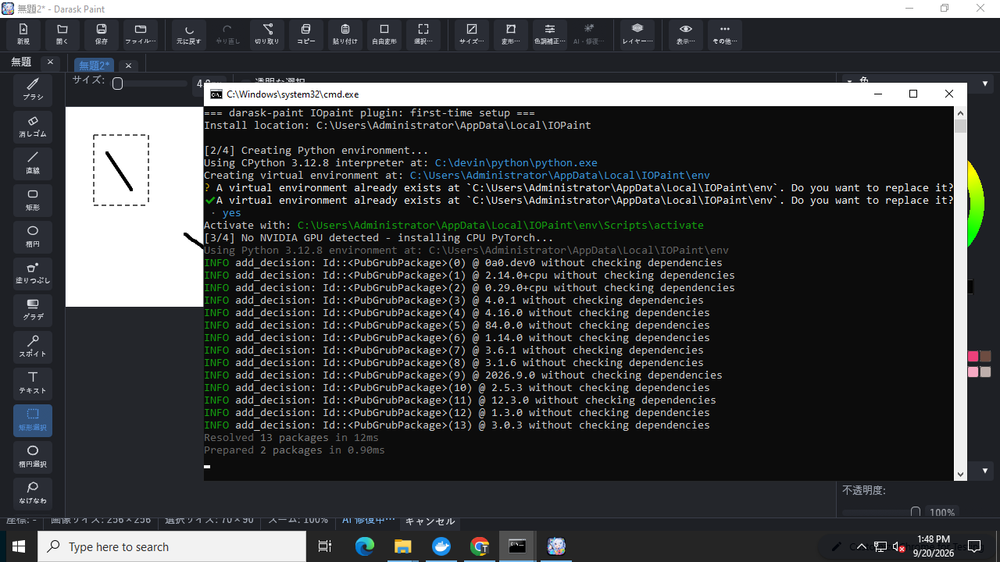
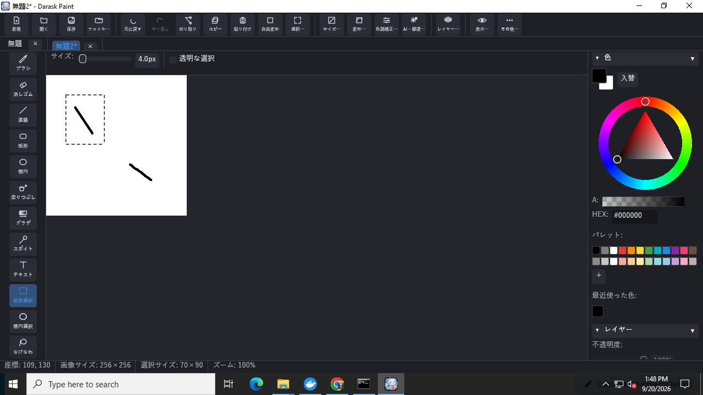
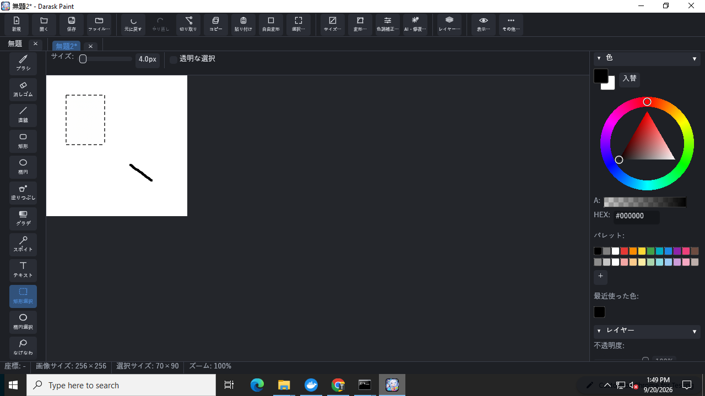

# darask-paint-iopaint — Darask Paint 用 AI 修復プラグイン

[Darask Paint](https://github.com/daraskme/darask-paint) の「AI 修復(IOpaint)」メニューから使う、
ローカル AI インペインティングサーバのプラグインリポジトリです。

エンジンは [daraskme/IOpaint](https://github.com/daraskme/IOpaint)
([Sanster/IOPaint](https://github.com/Sanster/IOPaint) のフォーク、Apache-2.0)。
このリポジトリは「Darask Paint から使うためのランチャーとマニフェスト」を提供する薄いアダプタで、
エンジン本体は IOpaint フォークの**特定タグに固定**して `git+https://` 経由でインストールします
(コードの二重管理をしない。「latest」は追いません — `--darask-plugin-mode` の安全性
(CORS 無効化・ルート限定・モデル固定・DNS リバインディング対策)はセキュリティ境界であり、
タグを明示的に上げたときだけ更新されるべきものです)。**`daraskme/IOpaint` v2.0.0-rc2 以降が必須**
です(`--darask-plugin-mode` を実装した最初のリリース)。

## 仕組み

```
Darask Paint (Rust, 単一exe)
   │  選択範囲の画像 + マスク (HTTP POST /api/v1/inpaint, 127.0.0.1 限定)
   ▼
darask-plugin.bat → IOpaint サーバ (Python, LaMa モデル, ポート 8423)
   │  修復済み画像
   ▼
Darask Paint がアクティブレイヤーの選択範囲だけに書き戻し(1 回の元に戻す単位)
```

Darask Paint 本体は依存を増やさず高速起動のまま。AI はこのプラグインを起動したときだけ使えます。

## 使い方(推奨: zip を置くだけ)

1. [Releases](https://github.com/daraskme/darask-paint-iopaint/releases) から
   `darask-paint-iopaint-plugin-vX.Y.Z.zip` をダウンロード
2. `darask-paint.exe` と同じ階層に `plugins` フォルダを作り、zip を**そのまま**置く
   (展開不要。設定ダイアログ(Ctrl+K)の「プラグインフォルダ」で別の場所を指定することもできます)
   ```
   darask-paint.exe
   plugins\
     darask-paint-iopaint-plugin-v1.0.0.zip
   ```
3. Darask Paint で修復したい範囲を選択し、メニューの「**AI 修復(IOpaint)…**」を実行
   - 本体が zip を `plugins\darask-paint-iopaint-plugin-v1.0.0\` に展開し、`darask-plugin.bat` を
     新しいコンソール窓で起動して、サーバが応答するまで(最大 2 分)待ちます
   - 初回は下記のインストール(数分)が走るため 2 分を超えることがあります。その場合は
     「起動中」のメッセージが出るので、コンソールのインストール完了後にもう一度実行してください
   - zip を新しいバージョンに差し替えると、次回実行時に自動で再展開されます
4. プラグインの黒い窓を閉じればサーバ停止(Darask Paint 本体はプラグインなしでも全機能動作)

### 動作例(Windows, CPU のみ)

| `plugins` フォルダに zip を置く | 初回セットアップの黒い窓(CPU 版 PyTorch を自動選択) |
|---|---|
|  |  |

| 修復前: 選択範囲内の黒線 | 修復後: 選択範囲内だけ消え、選択外の線は保持 |
|---|---|
|  |  |

zip を自分で作る場合は `pwsh ./package-plugin.ps1 -Version plugin-vX.Y.Z` を実行します
(`plugin-v*` タグを push すると GitHub Actions が同じ zip を Release に添付します)。

## 使い方(手動起動)

1. `darask-plugin.bat` をダブルクリック
   - 初回のみ: [git](https://git-scm.com/downloads)(`git+https://` インストールに必須)が
     PATH にあることを確認 → uv の導入 → Python 環境作成 → PyTorch(NVIDIA GPU があれば CUDA 12.8、
     なければ CPU)→ IOpaint を `v2.0.0-rc2` タグに固定してインストール(数分)。環境は
     `%LOCALAPPDATA%\IOPaint` に作られ、IOpaint 単体の `IOPaint-OneClick.bat` と共有されます
     (二重インストールなし)。
   - 2 回目以降の起動時、インストール済みバージョンが固定タグと異なる場合は自動で固定タグへ更新してから起動します。
   - 初回起動時に LaMa モデル(約 200MB)が自動ダウンロードされます。
2. Darask Paint で修復したい範囲を選択(矩形/楕円/なげなわ/自動選択)
3. メニューの「**AI 修復(IOpaint)…**」を実行
4. プラグインの黒い窓を閉じればサーバ停止(Darask Paint 本体はプラグインなしでも全機能動作)

- サーバは `127.0.0.1:8423` で待ち受けます(ローカル専用。外部には一切公開されません)。
- **`--darask-plugin-mode`(health/inpaint 限定・CORS 無効・モデル固定・DNS リバインディング対策の制限モード)は必須です。フォールバックはありません** — 固定タグのインストールがこのモードに対応しない場合、`darask-plugin.bat` はエラーを表示して起動を中止します(通常の無制限モードで黙って立ち上がることはありません)。
- Darask Paint 側の接続先は設定ダイアログ(Ctrl+K)で変更できます。
- オフラインで軽く済ませたい場合は、本体内蔵の「選択範囲を修復」(非 AI)も使えます。

## 動作要件

| 環境 | 目安 |
|---|---|
| NVIDIA GPU (VRAM 4GB+) | 快適(1 回あたり ~1 秒) |
| CPU のみ | 動作可(1 回あたり数秒〜数十秒) |

## ライセンス

Apache-2.0(エンジンの IOPaint に準拠。`LICENSE` 参照)。
